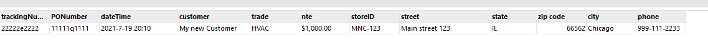

### HTML Parser

this parser can be used to parse html file to csv .
to try it you can use `wo_for_parse.html` file.

that is how it looks.

---
### Extension guide

* To extend to this project,you just add file type that you would convert your files to in `index.html` file.
* Add case of the file type to `ConverterFactory` that returns the converter controller.
* Then create a file inside `Backend\Converters` folder and implement `ConverterInterface` interface which will force you to have `convert` method.
Then add your converter logic.

__note__ : There is no need to include any file,Autoloader will get the job done for you.